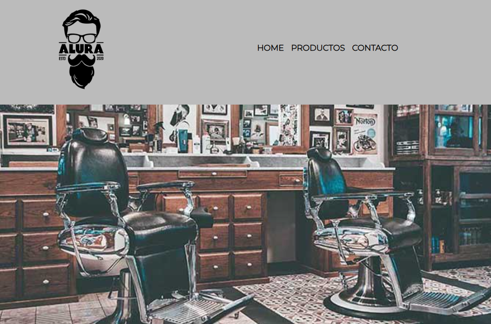

# 🌐 Barbería Alura

  

Este proyecto es un sitio web desarrollado con **HTML5 y CSS3** con un diseño **100% responsivo** que se adapta a distintos dispositivos y tamaños de pantalla. Se han aplicado **buenas prácticas de maquetación y accesibilidad** para garantizar una excelente experiencia de usuario.

## 🚀 Tecnologías utilizadas  
- **HTML5** → Estructura semántica  
- **CSS3** → Estilos y diseño responsivo  
- **Media Queries** → Adaptabilidad a diferentes dispositivos  

## 🎨 Características  
✅ Diseño completamente adaptable (responsive)  
✅ Código limpio y estructurado  
✅ Compatibilidad con los principales navegadores  
✅ Optimización para accesibilidad y SEO  

## 📂 Instalación y uso  
1. **Clonar el repositorio**  
   ```bash
   git clone https://github.com/tuusuario/nombre-del-repositorio.git

